# Requirements for this POC

In this POC we will use Multipass to create instances to install the Gogs and Microk8s, then establishing the Git server as a GitOps for the Kubernetes cluster provisioned with Microk8s.

## Install Multipass

```bash
sudo snap install multipass --classic
```

# MicroK8s

MicroK8s is the smallest, fastest, fully-conformant Kubernetes that tracks upstream releases and makes clustering trivial. MicroK8s is great for offline development, prototyping, and testing.

## Create a MicroK8s template

```bash
echo '#cloud-config
runcmd:
  - apt update --fix-missing
  - snap refresh
  - snap install microk8s --classic
  - microk8s status --wait-ready
  - microk8s enable dns ingress' > cloud-config-microk8s.yaml
```

## Create a MicroK8s instance

```bash
multipass launch focal -n microk8s -c 2 -m 2G -d 10G --cloud-init cloud-config-microk8s.yaml
```

## Export the current MicroK8s configuration for use with Kubectl

### Create the folder to store the configuration of the Kubernetes cluster in the instance

```bash
sudo mkdir -p $HOME/.kube/configs
```

### Export the MicroK8s configuration in the instance to the created folder

```bash
multipass exec microk8s -- sudo microk8s config > $HOME/.kube/configs/config-microk8s
```

### Use in your session the configuration exported as default for use with Kubectl

```bash
export KUBECONFIG=$HOME/.kube/configs/config-microk8s
```

```bash
chmod 0600 $KUBECONFIG
```

### Install Kubectl

```bash
sudo snap install kubectl --classic
```

```bash
kubectl get no
```

```txt
NAME       STATUS   ROLES    AGE   VERSION
microk8s   Ready    <none>   59m   v1.21.5-3+83e2bb7ee39726
```

### Add an IP alias of the microk8s instance to microk8s.local

```bash
multipass info microk8s | grep IPv4 | cut -f 2 -d ":" | tr -d [:blank:] | sed 's/$/     microk8s.local/' | sudo tee -a /etc/hosts
```

### Add an IP alias of the microk8s instance to app01.local, app02.local and app03.local

```bash
multipass info microk8s | grep IPv4 | cut -f 2 -d ":" | tr -d [:blank:] | sed 's/$/     app01.local app02.local app03.local/' | sudo tee -a /etc/hosts
```

### Create yaml for endpoint pointing to instance gogs

```bash
echo 'apiVersion: v1
items:
  - apiVersion: v1
    kind: Service
    metadata:
      name: gogs
      namespace: default
    spec:
      clusterIP: None
      ports:
        - name: gogs
          port: 3000
          targetPort: 3000
  - apiVersion: v1
    kind: Endpoints
    metadata:
      name: gogs
      namespace: default
    subsets:
      - addresses:
          - ip: GogsIP
        ports:
          - name: gogs
            port: 3000
            protocol: TCP
kind: List
metadata: {}' > gogs_endpoint.yaml
```

### Add IP of the gogs instance to the endpoint yaml

```bash
for i in `multipass info gogs | grep IPv4 | cut -f 2 -d ":" | tr -d [:blank:]` ; do sed -i s/GogsIP/$i/ gogs_endpoint.yaml ; done
```

### Create the endpoint pointing to the gogs instance

```bash
kubectl apply -f gogs_endpoint.yaml
```

### The endpoint to gogs instance

```text
http://gogs.default.svc.cluster.local:3000/
```

### URL for microk8s.local

<http://microk8s.local>

## Install Argo CD

# Argo CD

Argo CD is a declarative, GitOps continuous delivery tool for Kubernetes.

## Deploy Argo CD in Kubernetes cluster

```bash
helm repo add argo https://argoproj.github.io/argo-helm
helm repo update
helm install argocd argo/argo-cd --set 'server.extraArgs={--insecure}' --namespace argocd --create-namespace
```

Source: https://github.com/argoproj/argo-helm/tree/master/charts/argo-cd

```bash
echo 'apiVersion: networking.k8s.io/v1
kind: Ingress
metadata:
  name: argocd-ingress
  namespace: argocd
spec:
  rules:
    - host: argocd.local
      http:
        paths:
          - backend:
              service:
                name: argocd-server
                port:
                  number: 443
            path: /
            pathType: Prefix' > argocd_ingress.yaml
```

```bash
kubectl apply -f argocd_ingress.yaml
```

```bash
multipass info microk8s | grep IPv4 | cut -f 2 -d ":" | tr -d [:blank:] | sed 's/$/     argocd.local/' | sudo tee -a /etc/hosts
```

### Show password for Admin user

```bash
export ARGO_PWD=`kubectl -n argocd get secret argocd-initial-admin-secret -o jsonpath="{.data.password}" | base64 -d`
echo $ARGO_PWD
```

### URL for argocd.local

<http://argocd.local>

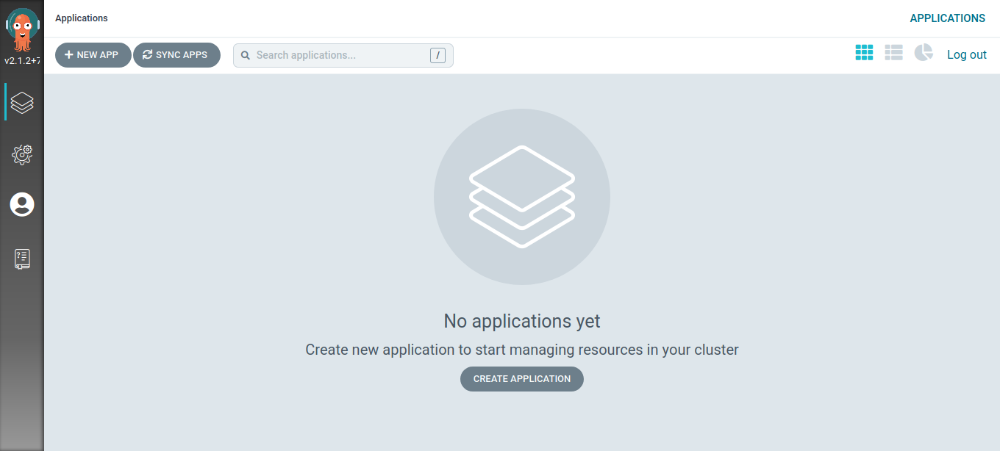

## Install Gogs

# Gogs

Gogs is a painless self-hosted Git service. This project aims to build a simple, stable and extensible self-hosted Git service that can be setup in the most painless way.

## Create a cloud-init for the Gogs instance with Multipass

```bash
echo '#cloud-config
write_files:
  - path: /etc/rc.local
    owner: root:root
    permissions: 0777
    content: |
      #!/bin/bash
      exec sudo /opt/gogs/gogs web &
      exit 0
    append: true
  - path: /opt/gogs/custom/conf/app.ini
    owner: root:root
    permissions: 0777
    content: |
      BRAND_NAME = Gogs
      RUN_USER   = root
      RUN_MODE   = prod

      [database]
      TYPE     = sqlite3
      HOST     = 127.0.0.1:5432
      NAME     = gogs
      USER     = gogs
      PASSWORD =
      SSL_MODE = disable
      PATH     = data/gogs.db

      [repository]
      ROOT = /opt/gogs/gogs-repositories

      [server]
      DOMAIN           = gogs.local
      HTTP_PORT        = 3000
      EXTERNAL_URL     = http://gogs.local:3000/
      DISABLE_SSH      = false
      SSH_PORT         = 2222
      START_SSH_SERVER = true
      OFFLINE_MODE     = false

      [mailer]
      ENABLED = false

      [service]
      REGISTER_EMAIL_CONFIRM = false
      ENABLE_NOTIFY_MAIL     = false
      DISABLE_REGISTRATION   = false
      ENABLE_CAPTCHA         = true
      REQUIRE_SIGNIN_VIEW    = false

      [picture]
      DISABLE_GRAVATAR        = false
      ENABLE_FEDERATED_AVATAR = false

      [session]
      PROVIDER = file

      [log]
      MODE      = console, file
      LEVEL     = Info
      ROOT_PATH = /opt/gogs/log
    append: true
runcmd:
  - apt update --fix-missing
  - apt -y remove snapd --purge
  - cd /tmp
  - wget -c https://dl.gogs.io/0.12.3/gogs_0.12.3_linux_amd64.tar.gz
  - tar -zxvf gogs_0.12.3_linux_amd64.tar.gz
  - mkdir -p /opt/gogs/
  - chmod u+rxw /opt/gogs
  - cp -raf /tmp/gogs/gogs /opt/gogs/
  - chown -R root:root /opt/gogs
  - /opt/gogs/gogs web &' > cloud-config-gogs.yaml
```

## Create Gogs instance with Multipass

```bash
multipass launch focal -n gogs -c 1 -m 1G -d 5G --cloud-init cloud-config-gogs.yaml
```

## Add an IP alias of the Gogs instance to gogs.local

```bash
multipass info gogs | grep IPv4 | cut -f 2 -d ":" | tr -d [:blank:] | sed 's/$/     gogs.local/' | sudo tee -a /etc/hosts
```

### URL for gogs.local

<http://gogs.local>

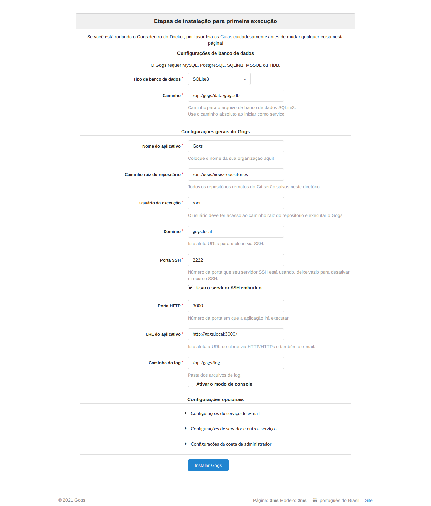

## Create **administrator** and **k8s** users

```bash
multipass exec gogs -- sudo /opt/gogs/gogs admin create-user --name administrator --password administrator --admin --email administrator@example.com
```

```bash
multipass exec gogs -- sudo /opt/gogs/gogs admin create-user --name k8s --password k8s --email k8s@example.com
```

## Reboot Gogs

```bash
multipass exec gogs -- sudo reboot
```

## Access Gogs

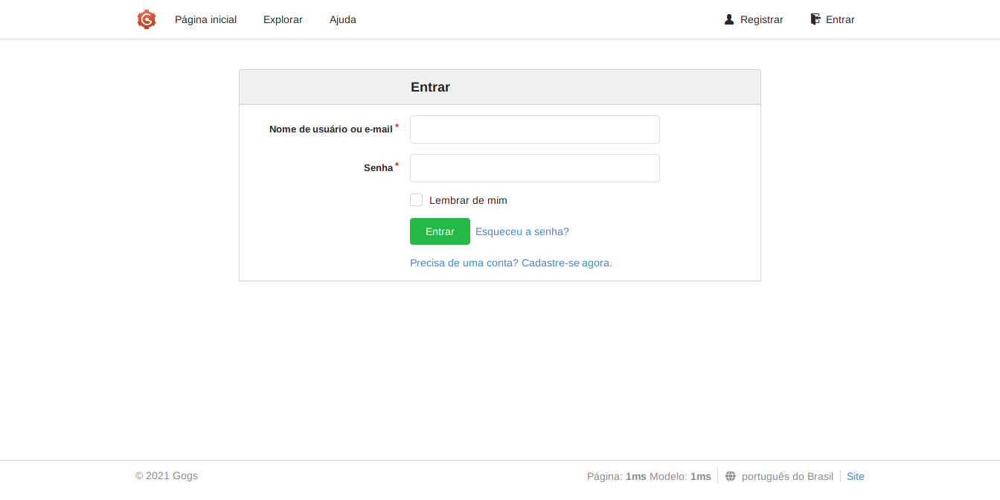

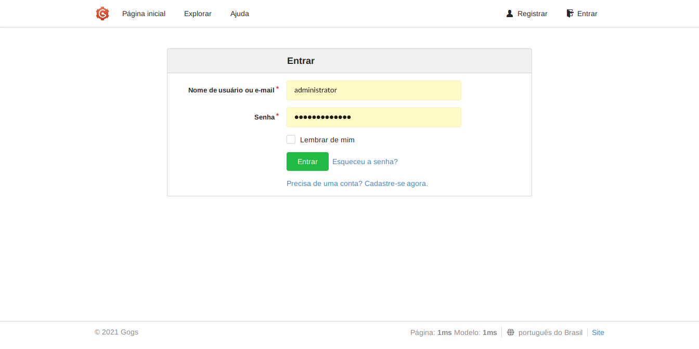

## Create a **apps** repository

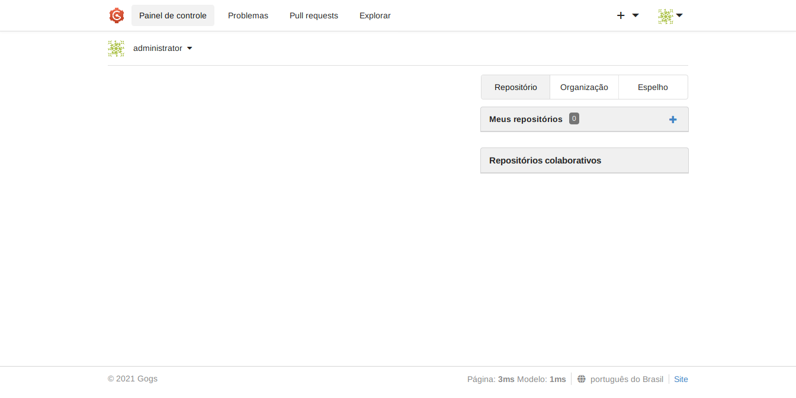

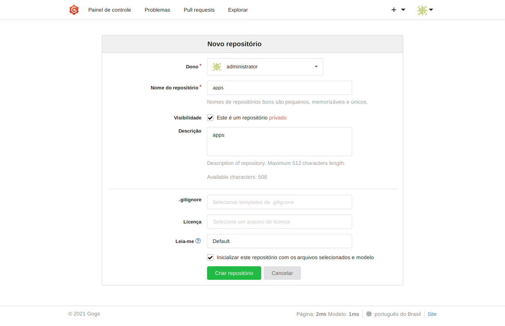

## Add **k8s** user to **apps** repository

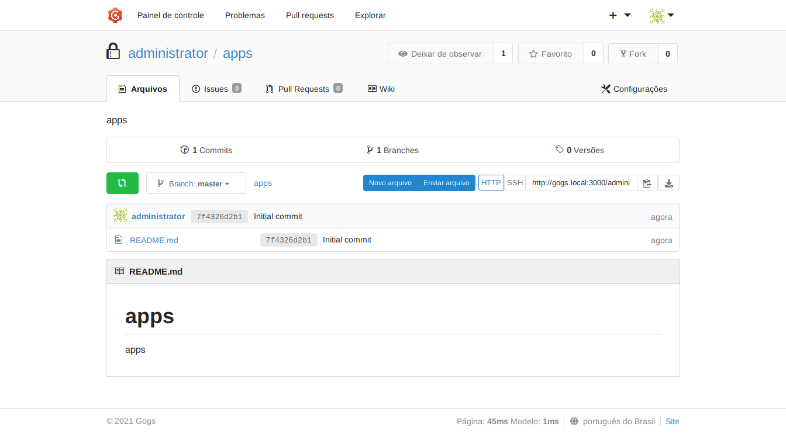

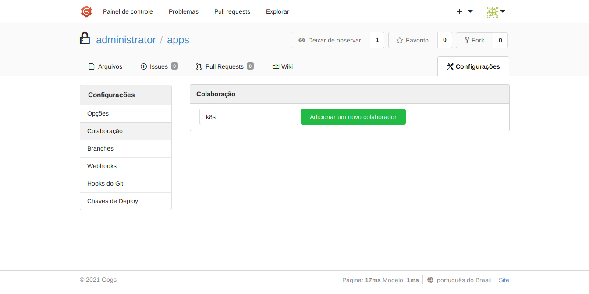

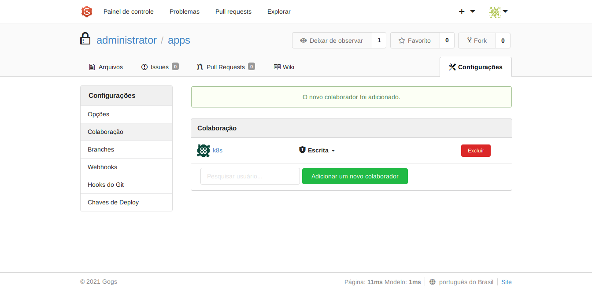

## Create a SSH key (Optional)

```bash
ssh-keygen -t ed25519 -C "administrator@example.com" -f ssh-key-gogs
```

## Clone **apps** repository

```bash
git clone http://gogs.local:3000/administrator/apps.git
```

```text
Cloning into 'apps'...
remote: Enumerating objects: 3, done.
remote: Counting objects: 100% (3/3), done.
remote: Total 3 (delta 0), reused 0 (delta 0)
Unpacking objects: 100% (3/3), 217 bytes | 217.00 KiB/s, done.
```

## Create sample apps

```bash
cd apps
mkdir -p apps/{app01,app02,app03}
echo 'apiVersion: v1
items:
  - apiVersion: v1
    kind: Namespace
    metadata:
      name: app03
  - apiVersion: v1
    data:
      default.conf: |
        server {
            listen       8080;
            listen  [::]:8080;
            server_name  localhost;
            location / {
                root   /usr/share/nginx/html;
                index  index.html index.htm;
            }
            error_page   500 502 503 504  /50x.html;
            location = /50x.html {
                root   /usr/share/nginx/html;
            }
        }
    kind: ConfigMap
    metadata:
      name: app03-config
      namespace: app03
  - apiVersion: apps/v1
    kind: Deployment
    metadata:
      labels:
        app: app03-deployment
      name: app03-deployment
      namespace: app03
    spec:
      replicas: 1
      selector:
        matchLabels:
          app: app03-deployment
      strategy:
        rollingUpdate:
          maxSurge: 25%
          maxUnavailable: 25%
        type: RollingUpdate
      template:
        metadata:
          labels:
            app: app03-deployment
        spec:
          containers:
            - image: nginx:stable
              name: app03-pod
              ports:
                - containerPort: 8080
                  protocol: TCP
              volumeMounts:
                - mountPath: /etc/nginx/conf.d
                  name: app03-config
          dnsPolicy: ClusterFirst
          volumes:
            - configMap:
                name: app03-config
              name: app03-config
  - apiVersion: v1
    kind: Service
    metadata:
      labels:
        app: app03-deployment
      name: app03-service
      namespace: app03
    spec:
      ports:
        - port: 8080
      selector:
        app: app03-deployment
      type: NodePort
  - apiVersion: networking.k8s.io/v1
    kind: Ingress
    metadata:
      name: app03-ingress
      namespace: app03
    spec:
      rules:
        - host: app03.local
          http:
            paths:
              - backend:
                  service:
                    name: app03-service
                    port:
                      number: 8080
                path: /
                pathType: Prefix
kind: List
metadata: {}' > apps/app03/app03_list.yaml
echo '---
apiVersion: v1
kind: Namespace
metadata:
  name: app02
---
apiVersion: v1
kind: ConfigMap
metadata:
  name: app02-config
  namespace: app02
data:
  default.conf: |
    server {
        listen       8080;
        listen  [::]:8080;
        server_name  localhost;
        location / {
            root   /usr/share/nginx/html;
            index  index.html index.htm;
        }
        error_page   500 502 503 504  /50x.html;
        location = /50x.html {
            root   /usr/share/nginx/html;
        }
    }
---
apiVersion: apps/v1
kind: Deployment
metadata:
  labels:
    app: app02-deployment
  name: app02-deployment
  namespace: app02
spec:
  replicas: 1
  selector:
    matchLabels:
      app: app02-deployment
  strategy:
    rollingUpdate:
      maxSurge: 25%
      maxUnavailable: 25%
    type: RollingUpdate
  template:
    metadata:
      labels:
        app: app02-deployment
    spec:
      containers:
        - image: nginx:stable
          name: app02-pod
          ports:
            - containerPort: 8080
              protocol: TCP
          resources: {}
          volumeMounts:
            - name: app02-config
              mountPath: /etc/nginx/conf.d
      volumes:
        - name: app02-config
          configMap:
            name: app02-config
      dnsPolicy: ClusterFirst
---
apiVersion: v1
kind: Service
metadata:
  labels:
    app: app02-deployment
  name: app02-service
  namespace: app02
spec:
  ports:
    - port: 8080
      protocol: TCP
      targetPort: 8080
  selector:
    app: app02-deployment
  type: NodePort
status:
  loadBalancer: {}
---
apiVersion: networking.k8s.io/v1
kind: Ingress
metadata:
  name: app02-ingress
  namespace: app02
spec:
  rules:
    - host: app02.local
      http:
        paths:
          - backend:
              service:
                name: app02-service
                port:
                  number: 8080
            path: /
            pathType: Prefix' > apps/app02/app02_concat.yaml
echo 'apiVersion: v1
kind: Namespace
metadata:
  name: app01' > apps/app01/app01_namespace.yaml
echo 'apiVersion: v1
kind: ConfigMap
metadata:
  name: app01-config
  namespace: app01
data:
  default.conf: |
    server {
        listen       8080;
        listen  [::]:8080;
        server_name  localhost;
        location / {
            root   /usr/share/nginx/html;
            index  index.html index.htm;
        }
        error_page   500 502 503 504  /50x.html;
        location = /50x.html {
            root   /usr/share/nginx/html;
        }
    }' > apps/app01/app01_configmap.yaml
echo 'apiVersion: apps/v1
kind: Deployment
metadata:
  labels:
    app: app01-deployment
  name: app01-deployment
  namespace: app01
spec:
  replicas: 1
  selector:
    matchLabels:
      app: app01-deployment
  strategy:
    rollingUpdate:
      maxSurge: 25%
      maxUnavailable: 25%
    type: RollingUpdate
  template:
    metadata:
      labels:
        app: app01-deployment
    spec:
      containers:
        - image: nginx:stable
          name: app01-pod
          ports:
            - containerPort: 8080
              protocol: TCP
          volumeMounts:
            - name: app01-config
              mountPath: /etc/nginx/conf.d
      volumes:
        - name: app01-config
          configMap:
            name: app01-config
      dnsPolicy: ClusterFirst' > apps/app01/app01_deployment.yaml
echo 'apiVersion: v1
kind: Service
metadata:
  labels:
    app: app01-deployment
  name: app01-service
  namespace: app01
spec:
  ports:
    - port: 8080
      protocol: TCP
      targetPort: 8080
  selector:
    app: app01-deployment
  type: NodePort
status:
  loadBalancer: {}' > apps/app01/app01_service.yaml
echo 'apiVersion: networking.k8s.io/v1
kind: Ingress
metadata:
  name: app01-ingress
  namespace: app01
spec:
  rules:
    - host: app01.local
      http:
        paths:
          - backend:
              service:
                name: app01-service
                port:
                  number: 8080
            path: /
            pathType: Prefix' > apps/app01/app01_ingress.yaml
```

```bash
git config --local user.name k8s
git config --local user.email k8s@example.com
git add -A
git commit -m "apps"
```

```text
[master ae43412] apps
 7 files changed, 288 insertions(+)
 create mode 100644 apps/app01/app01_configmap.yaml
 create mode 100644 apps/app01/app01_deployment.yaml
 create mode 100644 apps/app01/app01_ingress.yaml
 create mode 100644 apps/app01/app01_namespace.yaml
 create mode 100644 apps/app01/app01_service.yaml
 create mode 100644 apps/app02/app02_concat.yaml
 create mode 100644 apps/app03/app03_list.yaml
```

```bash
git push
```

```text
Enumerating objects: 14, done.
Counting objects: 100% (14/14), done.
Delta compression using up to 8 threads
Compressing objects: 100% (11/11), done.
Writing objects: 100% (13/13), 2.58 KiB | 2.58 MiB/s, done.
Total 13 (delta 2), reused 0 (delta 0)
To http://gogs.local:3000/administrator/apps.git
   7f4326d..ae43412  master -> master
```

### Add repository to Argo CD

**The original repository URL:**

<http://gogs.local:3000/administrator/apps.git>

**Using endpoint:**

<http://gogs.default.svc.cluster.local:3000/administrator/apps.git>

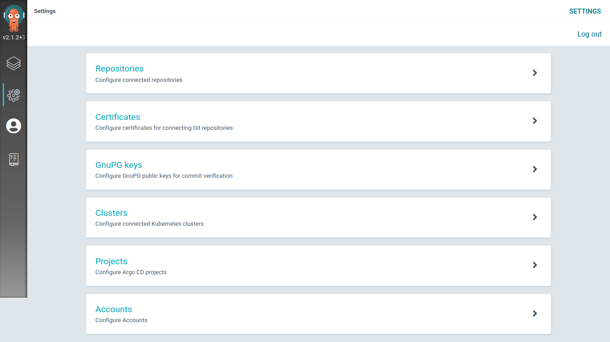
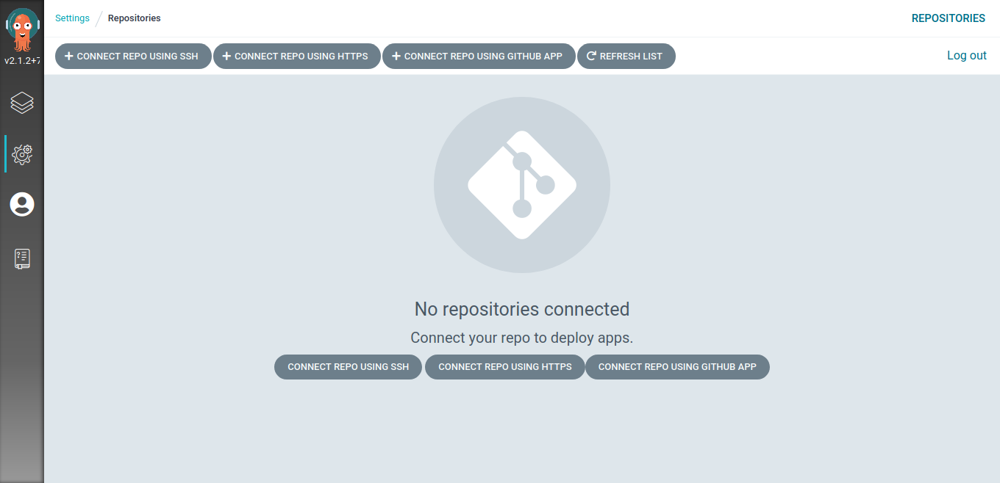
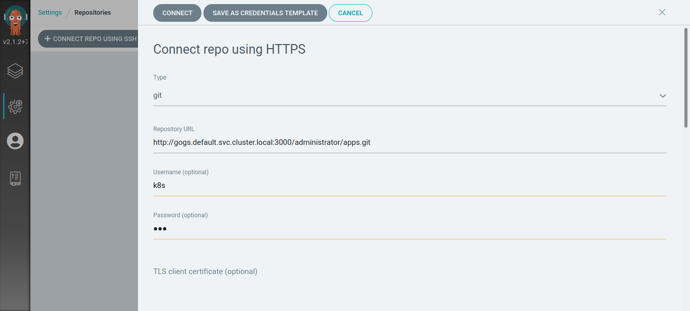
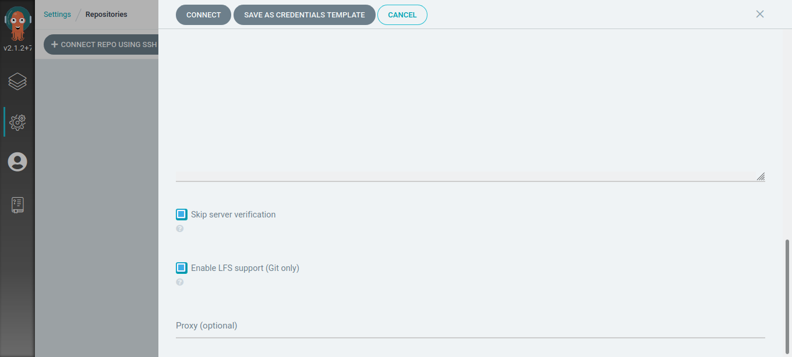
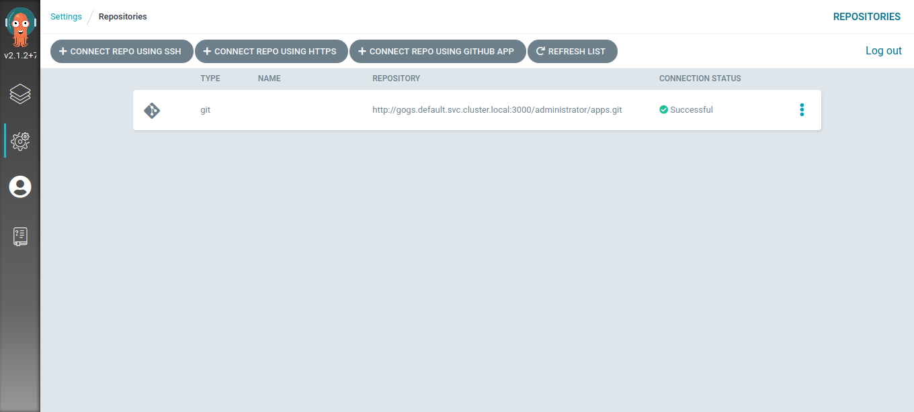

### Create application to Argo CD


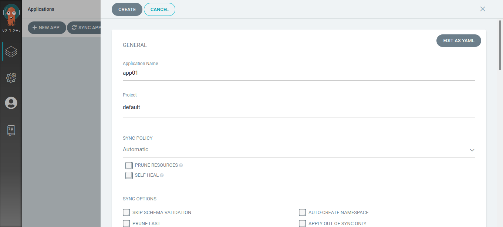
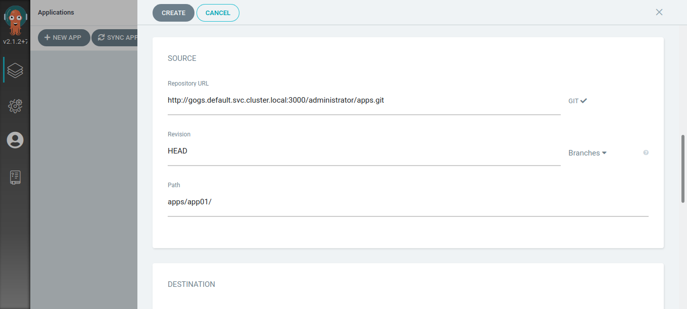
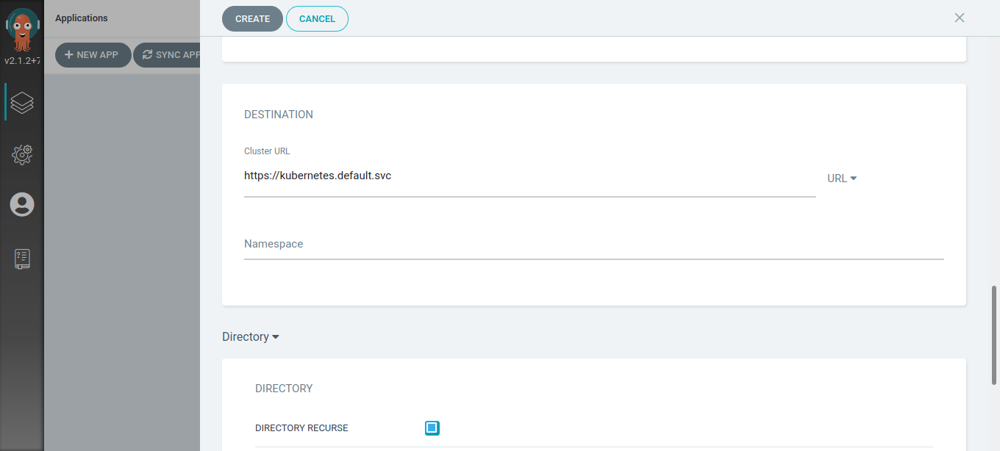
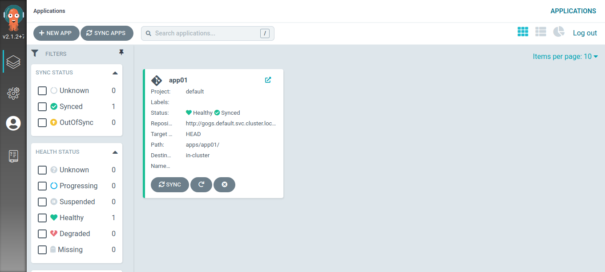
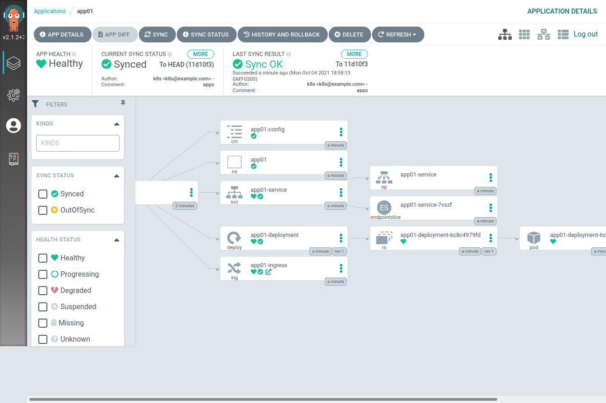

```bash
kubectl get all --namespace app01
```

```text
NAME                                    READY   STATUS    RESTARTS   AGE
pod/app01-deployment-6c8c4979fd-zdbbj   1/1     Running   0          1m50s

NAME                    TYPE       CLUSTER-IP       EXTERNAL-IP   PORT(S)          AGE
service/app01-service   NodePort   10.152.183.148   <none>        8080:31104/TCP   1m50s

NAME                               READY   UP-TO-DATE   AVAILABLE   AGE
deployment.apps/app01-deployment   1/1     1            1           1m50s

NAME                                          DESIRED   CURRENT   READY   AGE
replicaset.apps/app01-deployment-6c8c4979fd   1         1         1       1m50s

```
